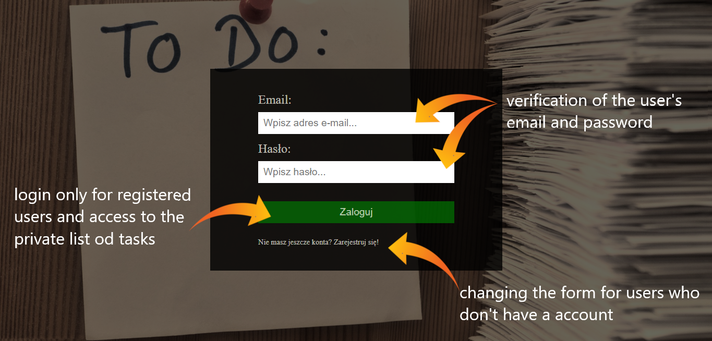
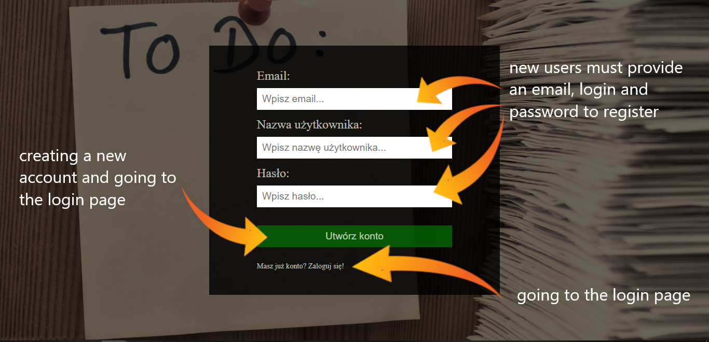
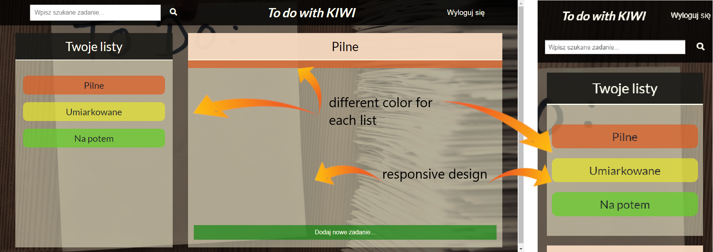

# toDoList
Website with a list of tasks that need to be done.

Description: 
In our simple, responsive To-Do list people can create a tasks (that is grouped in categories) and mark them as done or remove them.
App allows also registration of new users and gives access for indyvidual accounts after verification login data. 
On the client side of this project HTML5, CSS3 and Vanilla JavaScript have been used.
On the backend side: Node.js, MongoDB Atlas as a database which is hosted in a cloud and Express.js to create a sever and manage GET, POST, PUT, DELETE HTTP requests.

Authors: 
Urszula Kosior - main layout & main layout styling 
Kinga Mielcarska & Mateusz Hadrian - Vanilla JavaScript 
Justyna Kopiec, Jakub Bednarz & Konrad Jakubiec - backend side 

Screenshots:
1. Login:

2. Register:

3. Functionalities:

4. Visualisation:

